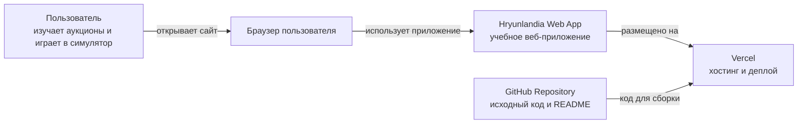
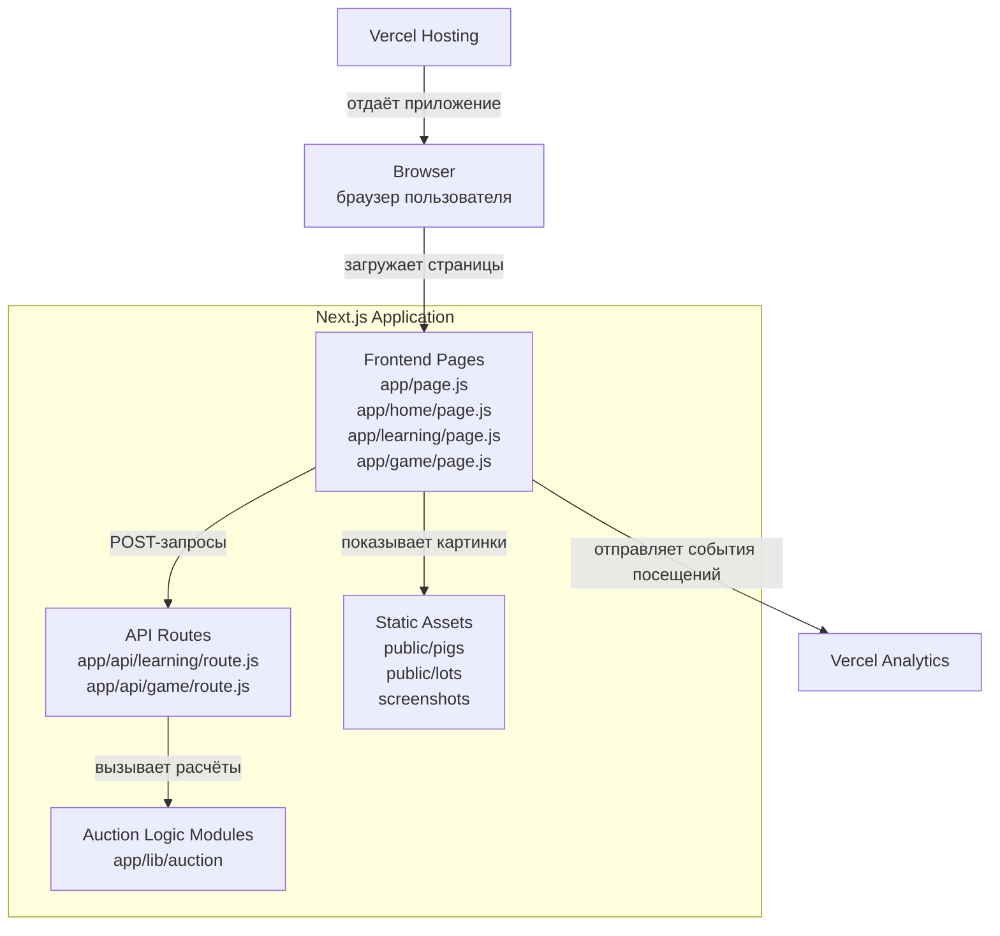
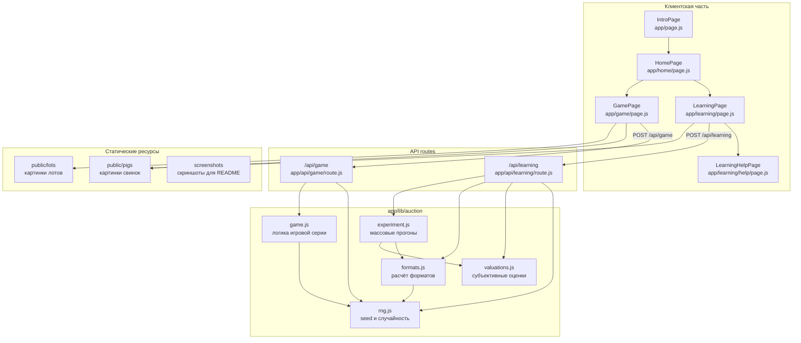
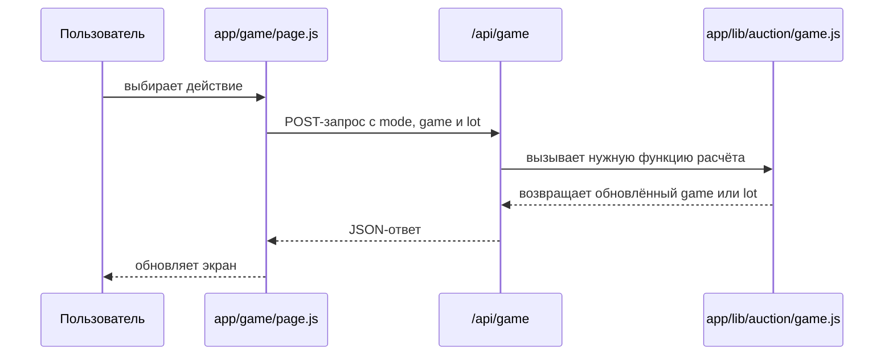
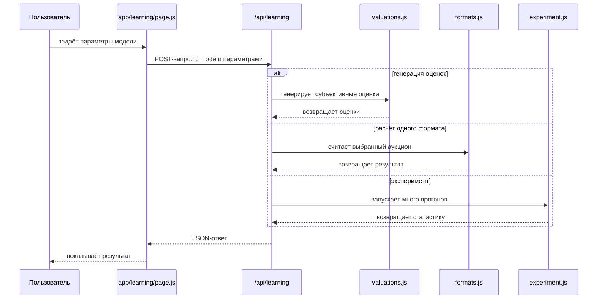

# Симулятор аукционной теории

Обучающее веб-приложение со сказочным сеттингом Хрюнляндии. В интерактивных экспериментах пользователь исследует 4 формата аукционов: английский, голландский, первая цена, Викри, поведение участников и выигрышные стратегии, сравнивает исходы и анализирует влияние информационного шума.

## Тема проекта

Экспериментальное моделирование аукционных механизмов: стратегии участников и влияние информационной неопределённости.

---

## Содержание

1. [Информация о приложении](#app-info)
2. [Информация для пользователя](#user-info)

   * [2.1. Структура приложения](#user-structure)
   * [2.2. Главный экран](#user-main-screen)
   * [2.3. Экран выбора режима](#user-mode-choice)
   * [2.4. Режим «Обучение»](#user-learning)
   * [2.5. Режим «Игра»](#user-game)
   * [2.6. Как проходят аукционы](#user-auctions)
   * [2.7. Итоги серии](#user-results)
   * [2.8. Свиньи-аукционеры](#user-pigs)
   * [2.9. Параметры приложения](#user-params)
   * [2.10. Показатели и статистика](#user-stats)
   * [2.11. Где можно пользоваться приложением](#user-where)
   * [2.12. Похожие проекты](#user-related)
3. [Информация для разработчика](#dev-info)

   * [3.1. Общая идея архитектуры](#dev-architecture-idea)
   * [3.2. Технологический стек](#dev-stack)
   * [3.3. Структура проекта](#dev-project-structure)
   * [3.4. Основные страницы](#dev-pages)
   * [3.5. API-маршруты](#dev-api)
   * [3.6. Модули аукционной логики](#dev-auction-modules)
   * [3.7. Архитектура по C4](#dev-c4)
   * [3.8. C4-схемы архитектуры](#dev-c4-diagrams)
   * [3.9. Модель данных режима игры](#dev-data-model)
   * [3.10. Основная игровая логика](#dev-game-logic)
   * [3.11. Реализация форматов аукционов](#dev-auction-formats)
   * [3.12. Типы свинок](#dev-pig-types)
   * [3.13. Seed и воспроизводимость](#dev-seed)
   * [3.14. Банки, жетоны и штраф](#dev-bank-tokens-penalty)
   * [3.15. Метрики итогов](#dev-metrics)
   * [3.16. Особенности хранения состояния](#dev-state)
   * [3.17. Статические ресурсы](#dev-assets)
   * [3.18. Ограничения текущей реализации](#dev-limitations)
   * [3.19. Возможные направления развития](#dev-future)
   * [3.20. Как запустить проект локально](#dev-local-run)
   * [3.21. Как деплоится проект](#dev-deploy)

---

<a id="app-info"></a>

# 1. Информация о приложении

Hryunlandia - это интерактивный обучающий симулятор аукционов для одного пользователя. Приложение знакомит с теорией аукционов и показывает работу четырёх основных форматов: английского, голландского, первой цены и Викри.

Вместо сухих формул пользователь попадает в сказочное королевство Хрюнляндию, где свинки-аукционеры торгуются за лоты, используют разные стратегии и по-разному реагируют на цену. Пользователь может сначала изучить механику торгов в режиме обучения, а затем сыграть полноценную серию аукционов в режиме игры.

[Открыть Хрюнляндию](https://hryunlandia.vercel.app)

---

<a id="user-info"></a>

# 2. Информация для пользователя

## 🐽 Добро пожаловать в Хрюнляндию

В королевстве Хрюнляндия уже много лет проходят легендарные аукционы за редчайшие трюфели и не только. Сюда приезжают лучшие торговцы со всего королевства, а победителем становится не самый богатый, а самый хитрый и расчётливый.

Но есть проблема: свинки-аукционеры используют совершенно разные стратегии. Кто-то торгуется честно, кто-то слишком агрессивно, кто-то осторожничает, а кто-то действует почти математически идеально.

Сможете ли Вы понять их поведение, научиться правильно ставить и выиграть как можно больше лотов?

Вместо скучных формул Вас ждут живые торги, разные типы соперников, необходимость продумывать собственную стратегию, эксперименты и целое свиное королевство со своими законами 🐷

---

<a id="user-structure"></a>

## 2.1. Структура приложения

Приложение делится на два больших режима:

**«Обучение»** - объясняет, как работают аукционы, какие стратегии используют [свинки-аукционеры](#user-pigs) и в каких форматах эти стратегии оказываются выгоднее 📚

**«Игра»** - позволяет самому поучаствовать во всех аукционах против свинок, настроив [параметры игры](#user-params) 🎮

---

<a id="user-main-screen"></a>

## 2.2. Главный экран

После запуска приложения пользователь попадает на вступительный экран Хрюнляндии, который погружает его в мир свиных аукционов.

На экране находится кнопка **«Попасть в Хрюнляндию»**. После нажатия пользователь переходит к выбору режима.

Также на главном экране есть кнопка **«О проекте»**, которая ведёт на GitHub-репозиторий.


---

<a id="user-mode-choice"></a>

## 2.3. Экран выбора режима

После входа открывается меню с двумя режимами:

**Обучение** - для изучения механик аукционов и поведения стратегий.

**Игра** - для полноценной серии аукционов против ботов.


---

<a id="user-learning"></a>

## 2.4. Режим «Обучение»

Этот режим нужен, чтобы пользователь без знаний теории игр смог быстро понять, как устроены аукционы, почему участники ведут себя по-разному и какие стратегии оказываются выгоднее.

Перед переходом в «Игру» настоятельно советуем сначала открыть «Обучение»: так будет проще понять, почему в одном аукционе выгодно ставить честно, а в другом лучше аккуратно занижать ставку.

### Экран 1 - выбор подрежима

Пользователь выбирает один из трёх вариантов:

**Демонстрация** - один запуск выбранного типа аукциона с подробным разбором.

**Сравнение форматов** - одни и те же оценки свинок одновременно прогоняются через английский, голландский, первую цену и Викри. Это позволяет увидеть, как меняются победитель, цена и ставки в зависимости от формата.

**Эксперимент** - массовая симуляция из 100 прогонов со статистикой. Она помогает увидеть не один случайный пример, а общую картину: какие свинки выигрывают чаще, какие форматы дают более высокие цены и где чаще возникают переплаты.


### Настройка и результаты в «Обучении»

В выбранном подрежиме пользователь задаёт [параметры модели](#user-params): истинную ценность лота, шум оценки, уровень агрессивности и уровень осторожности.


После запуска приложение генерирует оценки свинок-аукционеров и показывает результат: ставки, победителя, цену, субъективный выигрыш, ex post выигрыш и эффективность. В «Эксперименте» пользователь дополнительно видит статистику по множеству прогонов.


В режимах **«Демонстрация»** и **«Сравнение форматов»** доступна вкладка **«Справка»**. В ней описана вся необходимая теория: типы аукционов, поведение свинок-аукционеров и подсказки по стратегиям.


---

<a id="user-game"></a>

## 2.5. Режим «Игра»

После изучения теории пользователь может перейти в полноценную игру против ботов. Здесь уже нет готового ответа: нужно самому принимать решения, следить за банком и выбирать, за какие лоты действительно стоит бороться.

### Экран 1 - выбор типа аукциона

Пользователь выбирает один из четырёх форматов:

* английский;
* голландский;
* первая цена;
* Викри.

Каждый формат имеет свою механику. Самым динамичным является английский аукцион: цена растёт, участники по очереди повышают ставку или пасуют.


### Экран 2 - настройка серии

Здесь задаются:

* количество лотов;
* число соперников;
* уровень шума оценки;
* использование жетонов;
* seed для воспроизводимости серии.

Банк зависит от количества лотов: 3 лота - 300 хрюблей, 5 - 500, 7 - 700, 9 - 900. Денег не хватает на бездумную покупку всего подряд, поэтому игроку приходится выбирать, где стоит рисковать, а где лучше сохранить монеты.


### Экран 3 - использование жетонов

Перед лотами пользователь выбирает, стоит ли использовать жетоны точности.

Жетон уменьшает шум оценки вдвое: вместо диапазона ±y игрок получает более точную оценку в диапазоне ±y/2. Это помогает лучше понять ценность лота, но жетонов мало, поэтому тратить их нужно с умом.


---

<a id="user-auctions"></a>

## 2.6. Как проходят аукционы

### Английский аукцион

Цена постепенно растёт. На экране видно текущую цену, активных участников, историю повышений, собственную оценку игрока и остаток банка.

Игрок может повысить цену на **+1 / +2 / +3** или спасовать. Боты действуют по своим стратегиям: агрессивные могут делать резкие повышения, осторожные выходят раньше, рациональные занижают лимит по формуле, а честные держатся до своей оценки.


### Голландский аукцион

Цена постепенно падает. Задача игрока - вовремя нажать **«Беру!»** раньше остальных.

Главное - не купить слишком дорого, но и не ждать так долго, чтобы лот забрал соперник.


### Первая цена

Игрок делает закрытую ставку. Если ставка слишком низкая, лот уйдёт другому. Если слишком высокая, можно выиграть, но потерять прибыль.

Этот режим особенно хорошо показывает проблему шейдинга - занижения ставки относительно своей оценки.


### Викри

Игрок делает закрытую ставку, но победитель платит вторую по величине цену.

Из-за этого появляется интересный эффект: ставить честно оказывается выгодно. Этот режим помогает понять одну из самых известных идей теории аукционов.


---

<a id="user-results"></a>

## 2.7. Итоги серии

После завершения игры показывается полная статистика:

* победы;
* потраченные деньги;
* субъективный выигрыш;
* ex post выигрыш;
* ROI;
* остаток банка;
* результаты по каждому лоту.

Также у пользователя есть возможность угадать, какие именно свинки играли против него. Это помогает проверить, удалось ли распознать стратегии соперников по их поведению во время торгов.

Также в режиме «Игра» действует штраф за пассивность. Минимум побед без штрафа равен `ceil(количество лотов / 4)`. Если игрок выиграл меньше лотов, из итогового банка вычитается **100 хрюблей**. Это нужно, чтобы нельзя было просто всё время пасовать: игрок должен искать баланс между осторожностью и участием в торгах.


---

<a id="user-pigs"></a>

## 2.8. Свиньи-аукционеры


### Честная свинка

Во всех форматах ставит по своей субъективной оценке. Она не занижает ставку и не пытается специально сэкономить.

### Осторожная свинка

В английском, голландском и аукционе первой цены использует ставку или лимит `round(0.80 * оценка)`, то есть заметно занижает ставку. В Викри ставит честно, то есть всю свою субъективную оценку.

### Агрессивная свинка

В английском, голландском и аукционе первой цены использует ставку или лимит `round(0.95 * оценка)`, то есть ставит близко к своей оценке. В английском аукционе иногда делает jump-bid на +2 или +3, если это не выше её лимита. В Викри ставит честно, то есть всю свою субъективную оценку.

### Рациональная свинка

В английском, голландском и аукционе первой цены снижает ставку по формуле `round((1 - 1/n) * оценка)`, где `n` - количество участников. В Викри ставит всю субъективную оценку, потому что в этом формате честная ставка является лучшей стратегией.

---

<a id="user-params"></a>

## 2.9. Параметры приложения

**Истинная ценность лота `x`** - настоящая ценность лота в модели. Обычно находится в диапазоне от 60 до 200.


**Шум оценки `y`** - насколько неточно участники видят ценность лота. Чем выше шум, тем сложнее понять, сколько лот действительно стоит.


**Количество лотов** - длина серии. Для английского и голландского аукционов доступны 3, 5 или 7 лотов; для первой цены и Викри - 5, 7 или 9.


**Количество соперников** - число свинок-ботов в игре. Их типы скрыты и фиксируются на всю серию.


**Жетоны точности** - уменьшают шум оценки игрока на выбранном лоте. В открытых аукционах при 3 лотах даётся 1 жетон, при 5 или 7 - 2. В закрытых аукционах при 5 или 7 лотах даётся 2 жетона, при 9 - 3.


**Seed / Freeze** - настройка в режиме «Игра», которая фиксирует случайность и позволяет повторить серию с теми же исходными условиями.


---

<a id="user-stats"></a>

## 2.10. Показатели и статистика

**Субъективный выигрыш** = оценка победителя - цена. Показывает, насколько покупка выгодна с точки зрения самого победителя.


**Ex post выигрыш** = истинная ценность лота - цена. Показывает, была ли покупка выгодной относительно настоящей ценности.


**Итоговое состояние по истинной ценности** - итоговый результат пользователя с учётом настоящей ценности купленных лотов. Этот показатель помогает понять, насколько покупки были выгодны не только по субъективной оценке, а относительно реальной ценности лотов.


**Суммарный субъективный выигрыш** - общий выигрыш пользователя с точки зрения его собственных оценок лотов.


**Суммарный ex post выигрыш** - общий выигрыш пользователя относительно истинной ценности лотов.


**ROI по истинной ценности** показывает итоговую эффективность игры для пользователя: насколько удачно он распорядился своими хрюблями.


**Штраф за пассивность** - штраф, который применяется, если пользователь выиграл слишком мало лотов. Минимум побед без штрафа равен `ceil(количество лотов / 4)`. Если игрок выиграл меньше, из итогового результата вычитается 100 хрюблей.


---

<a id="user-where"></a>

## 2.11. Где можно пользоваться приложением

Хрюнляндия работает прямо в браузере. Пользоваться приложением можно на компьютере, ноутбуке, планшете или мобильном телефоне.

Ничего устанавливать не нужно. Достаточно открыть ссылку на сайт.

Возрастной рейтинг: **0+**.

---

<a id="user-related"></a>

## 2.12. Похожие проекты

* **Veconlab - Online Experiments for Economics**: классические аукционы и рыночные игры
  https://veconlab.econ.virginia.edu/

* **MobLab**: облачная платформа с экономическими играми и аукционами
  https://moblab.com/

* **EconPort**: библиотека и ПО для учебных аукционов и экспериментов
  http://www.econport.org/

---

<a id="dev-info"></a>

# 3. Информация для разработчика

<a id="dev-architecture-idea"></a>

## 3.1. Общая идея архитектуры

Hryunlandia - это учебное веб-приложение для моделирования аукционов. В проекте реализованы два основных режима: режим обучения и режим игры. Режим обучения нужен для объяснения механики аукционов и стратегий свинок, а режим игры нужен для интерактивной серии торгов, где пользователь соревнуется со скрытыми соперниками-свинками.

Приложение сделано на Next.js и React. Интерфейс реализован через страницы внутри папки `app`, серверные обработчики находятся в `app/api`, а основная аукционная логика вынесена в отдельные модули внутри `app/lib/auction`.

В проекте нет отдельной базы данных. Это осознанное архитектурное решение: приложение работает как учебный симулятор для одного пользователя, поэтому состояние игры хранится на клиенте и передаётся в API в формате JSON. API-маршруты получают текущее состояние, выполняют нужный расчёт и возвращают обновлённое состояние обратно на клиент.

<a id="dev-stack"></a>

## 3.2. Технологический стек

Проект использует:

* Next.js - основной фреймворк приложения
* React - построение интерфейса и управление состоянием экранов
* JavaScript - основной язык проекта
* Tailwind CSS - стилизация интерфейса
* Vercel - платформа для хостинга и автоматического деплоя приложения
* Vercel Analytics - аналитика посещений
* GitHub - хранение исходного кода и документации

В `package.json` заданы основные команды проекта:

```bash
npm run dev
npm run build
npm start
npm run lint
```

`npm run dev` запускает проект локально в режиме разработки.
`npm run build` собирает production-версию.
`npm start` запускает production-сборку.
`npm run lint` запускает проверку кода через ESLint.

<a id="dev-project-structure"></a>

## 3.3. Структура проекта

Основная структура проекта:

```text
app
  api
    game
      route.js
    learning
      route.js
  game
    page.js
  home
    page.js
  learning
    help
      page.js
    page.js
  lib
    auction
      experiment.js
      formats.js
      game.js
      rng.js
      valuations.js
  favicon.ico
  globals.css
  layout.js
  page.js

public
screenshots
.gitignore
eslint.config.mjs
jsconfig.json
next.config.mjs
package-lock.json
package.json
postcss.config.mjs
README.md
```

<a id="dev-pages"></a>

## 3.4. Основные страницы

`app/page.js` - главная страница приложения. На ней находится вводное описание проекта, кнопка входа в Хрюнляндию и кнопка `О проекте`, которая ведёт на GitHub-репозиторий.

`app/home/page.js` - страница выбора режима. Пользователь выбирает, перейти в режим обучения или в режим игры.

`app/learning/page.js` - основная страница режима обучения. Здесь пользователь выбирает подрежим обучения, задаёт параметры модели, генерирует или вручную задаёт оценки свинок, считает один формат аукциона, сравнивает форматы и запускает эксперимент.

`app/learning/help/page.js` - справочная страница режима обучения. Она объясняет, как устроены параметры модели, типы свинок, форматы аукционов и статистики.

`app/game/page.js` - основная страница режима игры. Здесь пользователь выбирает формат аукциона, настраивает серию, участвует в торгах, видит результаты лотов, итоговую таблицу серии и раскрывает типы свинок.

<a id="dev-api"></a>

## 3.5. API-маршруты

В проекте есть два основных API-маршрута.

`app/api/learning/route.js` отвечает за режим обучения. Он принимает POST-запросы от `app/learning/page.js` и выполняет действия, связанные с учебными расчётами.

Основные режимы работы `/api/learning`:

* `valuations` - сгенерировать субъективные оценки участников
* `calc` - рассчитать один выбранный формат аукциона
* `compare` - сравнить все форматы на одном наборе оценок
* `experiment` - запустить много прогонов и вернуть агрегированную статистику

`app/api/game/route.js` отвечает за режим игры. Он принимает POST-запросы от `app/game/page.js` и выполняет игровые действия.

Основные режимы работы `/api/game`:

* `start` - создать новую серию
* `new_lot` - создать новый лот
* `dutch_prepare` - подготовить пороги свинок для голландского аукциона
* `english_bot_step` - выполнить один ход свинки в английском аукционе
* `english_user_action` - применить действие пользователя в английском аукционе
* `english_duel_bot_step` - выполнить ход последней свинки в дуэли
* `first_price` - рассчитать аукцион первой цены
* `vickrey` - рассчитать аукцион Викри
* `settle` - применить результат лота к серии
* `finish` - завершить серию и посчитать итоговые метрики

<a id="dev-auction-modules"></a>

## 3.6. Модули аукционной логики

Основная логика вынесена в папку `app/lib/auction`.

`rng.js` содержит генератор псевдослучайных чисел с seed. Он нужен, чтобы результаты можно было повторять при одинаковом seed.

`valuations.js` отвечает за генерацию субъективных оценок в режиме обучения. Оценки строятся вокруг истинной ценности лота с учётом шума.

`formats.js` содержит расчёты отдельных форматов аукционов для режима обучения. В этом файле рассчитываются английский аукцион, голландский аукцион, аукцион первой цены и аукцион Викри.

`experiment.js` отвечает за массовые симуляции в режиме обучения. Он запускает много прогонов и считает статистику по форматам: частоты побед, среднюю цену сделки, средний субъективный выигрыш, средний ex post выигрыш и долю переплат.

`game.js` содержит основную игровую логику. В нём создаётся серия, создаются лоты, выбираются скрытые типы свинок, генерируются оценки, считаются банки, жетоны, ставки, победители, история лотов и финальная сводка.

<a id="dev-c4"></a>

## 3.7. Архитектура по C4

Для описания архитектуры проекта можно использовать C4-модель. Для этого проекта достаточно трёх уровней: Context, Container и Component. Уровень Code можно не рисовать отдельно, потому что проект небольшой, а основные модули уже описаны текстом.

### 3.7.1. Level 1: System Context

На уровне контекста вся Hryunlandia рассматривается как одна система.

Основная система:

* Hryunlandia Web App

Основные пользователи:

* ученики старших классов, интересующиеся экономикой, теорией игр и аукционами
* студенты экономических направлений
* преподаватели, использующие приложение как интерактивную модель для объяснения форматов аукционов
* пользователи, которые хотят изучить различия между форматами аукционов через симуляцию торгов

Внешние системы:

* GitHub - хранение исходного кода и документации
* Vercel - платформа для хостинга и автоматического деплоя приложения
* браузер пользователя - среда, через которую пользователь открывает приложение

На этом уровне нужно показать, что пользователь открывает веб-приложение в браузере, приложение размещено на Vercel, а исходный код лежит на GitHub.

### 3.7.2. Level 2: Container

На уровне контейнеров приложение можно разделить на несколько крупных частей.

Первый контейнер - клиентская часть. Это React-страницы внутри Next.js. Она отвечает за интерфейс, переходы между экранами, кнопки, формы, таблицы, подсказки, модальные окна и отображение результатов.

Второй контейнер - API routes. Это серверные обработчики внутри Next.js. Они принимают POST-запросы от клиентской части и вызывают функции из аукционной логики.

Третий контейнер - auction logic modules. Это файлы внутри `app/lib/auction`. Они отвечают за расчёты, симуляции, генерацию оценок, стратегии свинок и итоговые метрики.

Четвёртый контейнер - static assets. Это изображения, фон, картинки свинок, картинки лотов и скриншоты для README.

Отдельной базы данных нет. Состояние игры хранится на клиенте и передаётся в API как JSON.

### 3.7.3. Level 3: Component

На уровне компонентов можно подробнее описать внутреннее устройство проекта.

Компоненты клиентской части:

`IntroPage` - главная страница приложения.

`HomePage` - страница выбора режима.

`LearningPage` - основной компонент режима обучения. Он хранит текущий шаг обучения, выбранный подрежим, параметры модели, оценки свинок, выбранный формат, результат расчёта, результаты сравнения и статистику эксперимента.

`LearningHelpPage` - справочный экран режима обучения.

`GamePage` - основной компонент режима игры. Он хранит состояние серии, текущего лота, ставку пользователя, выбранный формат, количество лотов, число соперников, жетоны, итоговую сводку и состояние раскрытия свинок.

Компоненты серверной части:

`/api/learning` - API для учебных расчётов.

`/api/game` - API для игрового режима.

Компоненты аукционной логики:

`rng.js` - воспроизводимая случайность.

`valuations.js` - генерация оценок.

`formats.js` - расчёты отдельных форматов.

`experiment.js` - массовые эксперименты.

`game.js` - полная логика игровой серии.

<a id="dev-c4-diagrams"></a>

## 3.8. C4-схемы архитектуры

Ниже приведены C4-схемы архитектуры проекта. Для README используются Mermaid-схемы, потому что GitHub умеет отображать их прямо внутри markdown-файла.

### 3.8.1. Level 1: System Context

Эта схема показывает проект как одну систему и отображает, кто с ней взаимодействует.



### 3.8.2. Level 2: Container

Эта схема показывает основные контейнеры внутри приложения: клиентскую часть, API, модули логики и статические ресурсы.



### 3.8.3. Level 3: Component

Эта схема показывает компоненты внутри приложения подробнее: отдельно режим обучения, режим игры, API-маршруты и файлы аукционной логики.



### 3.8.4. Схема потока данных в режиме игры

Эта схема показывает, как данные проходят через режим игры: пользователь нажимает кнопку, страница отправляет текущее состояние в API, API вызывает игровую логику и возвращает обновлённый объект.



### 3.8.5. Схема потока данных в режиме обучения

Эта схема показывает, как работает режим обучения: пользователь задаёт параметры, страница отправляет их в API, а API вызывает учебные расчёты.



<a id="dev-data-model"></a>

## 3.9. Модель данных режима игры

В режиме игры есть два главных объекта: `game` и `lot`.

`game` описывает всю серию. В нём хранятся:

* формат аукциона
* количество лотов
* количество свинок
* шум оценки
* включены ли жетоны
* seed
* текущий номер лота
* стартовый банк
* банк пользователя
* банки свинок
* скрытые типы свинок
* минимальное число побед без штрафа
* история лотов
* порядок картинок лотов

`lot` описывает один конкретный лот. В нём хранятся:

* номер лота
* истинная ценность
* субъективная оценка пользователя
* субъективные оценки свинок
* текущая цена
* активные свинки
* лидер торгов
* логи событий
* фаза английского аукциона
* последняя ставка пользователя
* победитель
* цена покупки

После завершения лота результат переносится в `game.history`, банк победителя уменьшается, номер текущего лота увеличивается, и создаётся следующий лот.

<a id="dev-game-logic"></a>

## 3.10. Основная игровая логика

Режим игры работает как серия аукционов. Сначала пользователь выбирает формат аукциона, количество лотов, количество соперников, шум оценки, жетоны и seed. После этого создаётся серия.

Типы свинок в игре скрыты до конца серии. Они могут повторяться, то есть против пользователя могут оказаться, например, две рациональные или две осторожные свинки.

Перед каждым лотом пользователь может использовать жетон, если жетоны включены и ещё остались. Жетон уменьшает шум оценки пользователя для текущего лота.

После каждого лота показывается результат: победитель, цена, истинная ценность, оценка пользователя, ставка пользователя и выигрыш по разным метрикам.

В конце серии показывается итоговая таблица, сводка игрока, штраф за пассивность, ROI и раскрытие типов свинок.

<a id="dev-auction-formats"></a>

## 3.11. Реализация форматов аукционов

### Английский аукцион

Английский аукцион реализован как пошаговый открытый аукцион. Цена начинается ниже истинной ценности лота и постепенно повышается участниками.

Состояние английского аукциона хранит текущую цену, активных свинок, лидера, очередь текущего раунда, последнюю ставку пользователя и журнал событий.

Свинки ходят автоматически. Пользователь может включиться в торги, повысить цену на +1, +2 или +3, ждать или пасовать.

У каждой свинки есть лимит, до которого она готова повышать цену:

* честная свинка идёт до своей субъективной оценки
* агрессивная свинка идёт до `0.95*s`
* рациональная свинка идёт до `(1-1/n)*s`
* осторожная свинка идёт до `0.8*s`

Здесь `s` - субъективная оценка свинки, `n` - число участников аукциона, то есть пользователь плюс свинки.

У каждой свинки есть банк, поэтому фактический лимит равен минимуму из стратегического лимита и остатка банка.

При завершении английского аукциона движок должен учитывать не только то, кто остался активным, но и то, может ли последняя активная свинка купить лот по текущей цене с учётом стратегии и банка.

### Голландский аукцион

В голландском аукционе цена стартует сверху и постепенно снижается. Пользователь может нажать `Беру`, если хочет купить лот по текущей цене.

Свинки заранее получают пороги покупки. Если текущая цена становится не выше порога какой-то свинки и у неё хватает банка, она покупает лот.

Порог свинки считается так же, как ставка в аукционе первой цены:

* честная: `s`
* агрессивная: `0.95*s`
* рациональная: `(1-1/n)*s`
* осторожная: `0.8*s`

### Аукцион первой цены

В аукционе первой цены пользователь вводит закрытую ставку. Свинки тоже делают закрытые ставки по своим стратегиям.

Побеждает максимальная ставка. Победитель платит свою ставку.

Ставка свинки ограничивается её банком. Если стратегическая ставка выше остатка банка, фактическая ставка равна остатку банка.

### Аукцион Викри

В аукционе Викри все участники делают закрытые ставки. Побеждает максимальная ставка, но победитель платит вторую по величине ставку.

В этом формате свинки не используют стратегические коэффициенты. Честная, агрессивная, рациональная и осторожная свинки ставят свою субъективную оценку.

При этом в игровой реализации ставка свинки всё равно ограничивается её банком. Это сделано для согласованности игрового режима, где у всех участников ограниченные средства.

<a id="dev-pig-types"></a>

## 3.12. Типы свинок

В проекте используются четыре архетипа свинок.

Честная свинка ставит по своей субъективной оценке.

Агрессивная свинка ставит близко к субъективной оценке. В английском, голландском и первой цене она ориентируется на `0.95*s`. В английском аукционе она иногда делает резкий скачок ставки на +2 или +3.

Рациональная свинка снижает ставку по формуле `(1-1/n)*s`.

Осторожная свинка сильнее занижает ставку и ориентируется на `0.8*s`.

В Викри все свинки ставят свою субъективную оценку независимо от архетипа.

<a id="dev-seed"></a>

## 3.13. Seed и воспроизводимость

Seed нужен, чтобы случайность была воспроизводимой. При одинаковом seed можно повторить одинаковую серию или одинаковый эксперимент.

Seed влияет на:

* выбор типов свинок
* выбор картинок лотов
* генерацию истинной ценности лота
* генерацию субъективных оценок
* порядок ходов свинок в английском аукционе
* jump-bid агрессивной свинки

Для этого используется собственный генератор псевдослучайных чисел, а не `Math.random`.

<a id="dev-bank-tokens-penalty"></a>

## 3.14. Банки, жетоны и штраф

В начале серии пользователь и каждая свинка получают одинаковый стартовый банк. Стартовый банк считается как:

```text
lots*100
```

Если пользователь выигрывает лот, цена покупки списывается с его банка. Если лот выигрывает свинка, цена покупки списывается с банка этой свинки.

Жетоны - это дополнительная игровая механика. Если пользователь включает жетоны, перед отдельным лотом он может использовать жетон и уменьшить шум своей оценки.

В конце серии есть штраф за пассивность. Если пользователь купил меньше минимального числа лотов, из итогового банка вычитается 100 хрюблей. Минимальное число побед считается как:

```text
ceil(lots/4)
```

<a id="dev-metrics"></a>

## 3.15. Метрики итогов

В итогах используются несколько метрик.

Субъективный выигрыш показывает, насколько сделка выгодна с точки зрения оценки победителя. Он считается как:

```text
субъективная оценка победителя-цена покупки
```

Ex post выигрыш показывает, насколько сделка выгодна относительно настоящей ценности лота. Он считается как:

```text
истинная ценность лота-цена покупки
```

ROI по истинной ценности показывает доходность покупок пользователя относительно потраченной суммы.

Штраф за пассивность показывает, был ли пользователь слишком пассивен в серии.

Итоговое состояние по истинной ценности учитывает стартовый банк, суммарный ex post выигрыш и штраф.

<a id="dev-state"></a>

## 3.16. Особенности хранения состояния

Состояние игры не хранится в базе данных. Клиентская часть отправляет в API текущее состояние `game` и `lot`, а сервер возвращает обновлённую версию.

Плюсы такого подхода:

* не нужна база данных
* проект проще развернуть
* проще тестировать отдельные игровые шаги
* меньше серверной инфраструктуры

Минусы такого подхода:

* серия может потеряться при перезагрузке страницы
* нет истории игр между сессиями
* нет аккаунтов пользователей
* проект рассчитан на одного пользователя

Для учебного симулятора такой подход подходит, потому что главная цель проекта - показать механику аукционов.

<a id="dev-assets"></a>

## 3.17. Статические ресурсы

Папка `public` содержит статические изображения, которые используются в приложении. Картинки свинок доступны через пути вида:

```text
/pigs/honest_pig.png
/pigs/rational_pig.png
/pigs/agressive_pig.png
/pigs/cautious_pig.png
/pigs/mischievous_pig.png
/pigs/user_kitty.png
```

Картинки лотов доступны через пути вида:

```text
/lots/lot1.jpg
/lots/lot2.jpg
...
```

Папка `screenshots` находится в корне проекта и используется для хранения скриншотов, которые вставляются в README.

<a id="dev-limitations"></a>

## 3.18. Ограничения текущей реализации

Текущая версия приложения имеет несколько ограничений:

* нет базы данных
* нет авторизации
* нет аккаунтов пользователей
* состояние серии не сохраняется после перезагрузки страницы
* игра рассчитана на одного пользователя
* изображения пока используются как обычные статические файлы

Эти ограничения не мешают учебной цели проекта

<a id="dev-future"></a>

## 3.19. Возможные направления развития

В будущем проект можно расширить:

* добавить хранение игровых серий в базе данных
* добавить аккаунты пользователей
* добавить сохранение прогресса
* добавить таблицу лучших результатов
* добавить многопользовательский режим
* добавить анимации торгов и игровых событий
* добавить больше типов свинок
* добавить новые форматы аукционов
* оптимизировать изображения через `next/image` или WebP

<a id="dev-local-run"></a>

## 3.20. Как запустить проект локально

Чтобы запустить проект локально, нужно установить зависимости:

```bash
npm install
```

Запуск в режиме разработки:

```bash
npm run dev
```

После этого приложение будет доступно по адресу:

```text
http://localhost:3000
```

Сборка production-версии:

```bash
npm run build
```

Запуск production-сборки:

```bash
npm start
```

Проверка кода через ESLint:

```bash
npm run lint
```

<a id="dev-deploy"></a>

## 3.21. Как деплоится проект

Проект размещается на платформе Vercel. Production-ветка проекта - `master`.

Обычный порядок сохранения изменений в production:

```bash
git add .
git commit -m "описание изменения"
git push origin master
```

Если изменения сначала были сделаны в `main`, их нужно перенести в `master`:

```bash
git checkout master
git merge main
git push origin master
```

После push в production-ветку Vercel автоматически запускает новый деплой. Проверить статус деплоя можно во вкладке Deployments в интерфейсе Vercel
