# Симулятор аукционной теории

Обучающее веб-приложение со сказочным сеттингом Хрюнляндии. В интерактивных экспериментах пользователь исследует 4 формата аукционов (английский, голландский, первая цена, Викри), поведение участников и выигрышные стратегии, сравнивает исходы и анализирует влияние информационного шума.

## Тема проекта

Экспериментальное моделирование аукционных механизмов: стратегии участников и влияние информационной неопределённости.

---

# Для пользователя

## 🐽 Добро пожаловать в Хрюнляндию

В королевстве Хрюнляндия уже много лет проходят легендарные аукционы за редчайшие трюфели и не только. Сюда приезжают лучшие торговцы со всего королевства, а победителем становится не самый богатый, а самый хитрый и расчётливый.

Но есть проблема: свинки-аукционеры используют совершенно разные стратегии. Кто-то торгуется честно, кто-то слишком агрессивно, кто-то осторожничает, а кто-то действует почти математически идеально.

Сможете ли Вы понять их поведение, научиться правильно ставить и выиграть как можно больше лотов?

Наше приложение — это интерактивный обучающий симулятор аукционов для одного пользователя. Оно знакомит с теорией аукционов и показывает работу четырёх основных форматов: английского, голландского, первой цены и Викри.

Вместо скучных формул Вас ждут живые торги, разные типы соперников, необходимость продумывать собственную стратегию, эксперименты и целое свиное королевство со своими законами 🐷

[Открыть Хрюнляндию](https://hryunlandia.vercel.app)

---

## Содержание

- [Структура приложения](#структура-приложения)
- [Главный экран](#главный-экран)
- [Режим «Обучение»](#режим-обучение-)
- [Режим «Игра»](#режим-игра-)
- [Свиньи-аукционеры](#свиньи-аукционеры-)
- [Параметры приложения](#параметры-приложения-)
- [Показатели и статистика](#показатели-и-статистика-)
- [Где можно пользоваться приложением](#где-можно-пользоваться-приложением-)
- [Похожие проекты](#похожие-проекты)

---

## Структура приложения

Приложение делится на два больших режима:

**«Обучение»** — объясняет, как работают аукционы, какие стратегии используют [свинки-аукционеры](#свиньи-аукционеры-) и в каких форматах эти стратегии оказываются выгоднее 📚

**«Игра»** — позволяет самому поучаствовать во всех аукционах против свинок, настроив [параметры игры](#параметры-приложения-) 🎮

---

## Главный экран

После запуска приложения пользователь попадает на вступительный экран Хрюнляндии, который погружает его в мир свиных аукционов.

На экране находится кнопка **«Попасть в Хрюнляндию»**. После нажатия пользователь переходит к выбору режима.

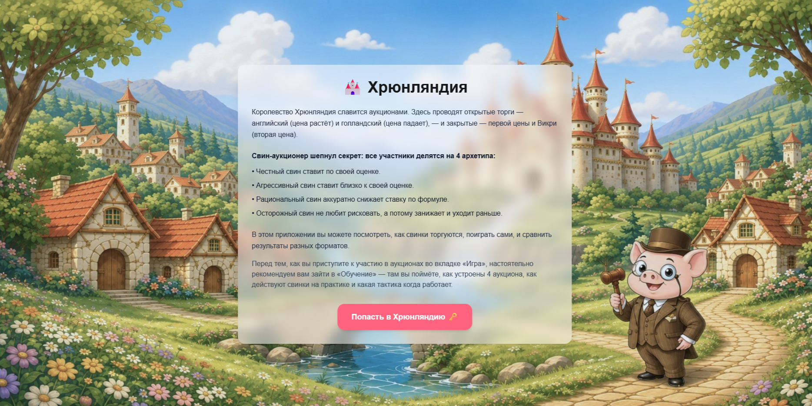

---

## Экран выбора режима

После входа открывается меню с двумя режимами:

**Обучение** — для изучения механик аукционов и поведения стратегий.

**Игра** — для полноценной серии аукционов против ботов.

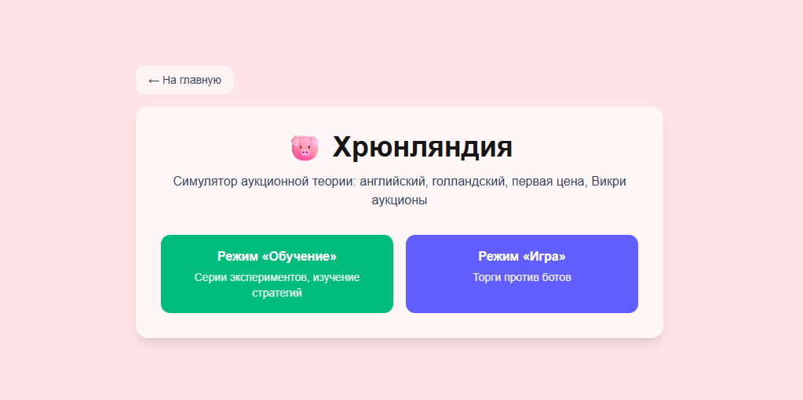

---

# Режим «Обучение» 📚

Этот режим нужен, чтобы пользователь без знаний теории игр смог быстро понять, как устроены аукционы, почему участники ведут себя по-разному и какие стратегии оказываются выгоднее.

Перед переходом в «Игру» настоятельно советуем сначала открыть «Обучение»: так будет проще понять, почему в одном аукционе выгодно ставить честно, а в другом лучше аккуратно занижать ставку.

## Экран 1 — выбор подрежима

Пользователь выбирает один из трёх вариантов:

**Демонстрация** — один запуск выбранного типа аукциона с подробным разбором.

**Сравнение форматов** — одни и те же оценки свинок одновременно прогоняются через английский, голландский, первую цену и Викри. Это позволяет увидеть, как меняются победитель, цена и ставки в зависимости от формата.

**Эксперимент** — массовая симуляция из 100 прогонов со статистикой. Она помогает увидеть не один случайный пример, а общую картину: какие свинки выигрывают чаще, какие форматы дают более высокие цены и где чаще возникают переплаты.

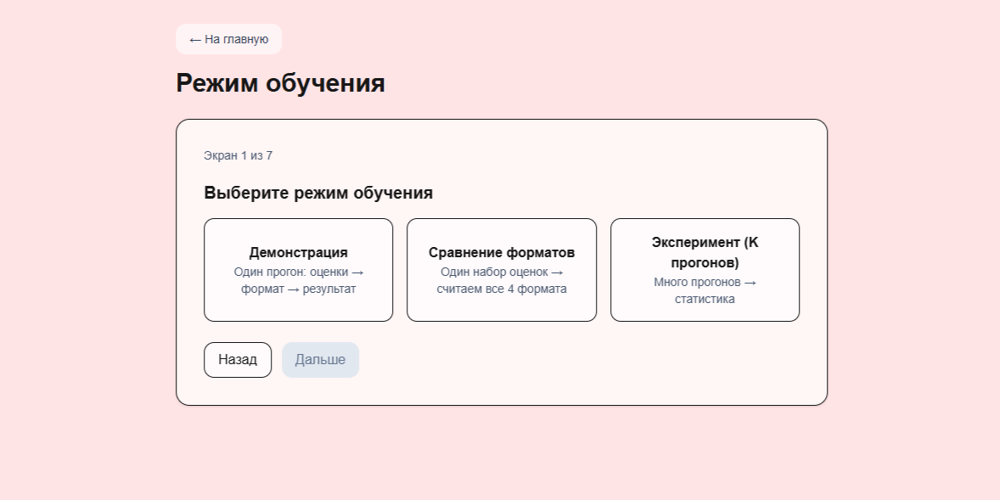

## Настройка и результаты в «Обучении»

В выбранном подрежиме пользователь задаёт [параметры модели](#параметры-приложения-): истинную ценность лота, шум оценки, уровень агрессивности и уровень осторожности.

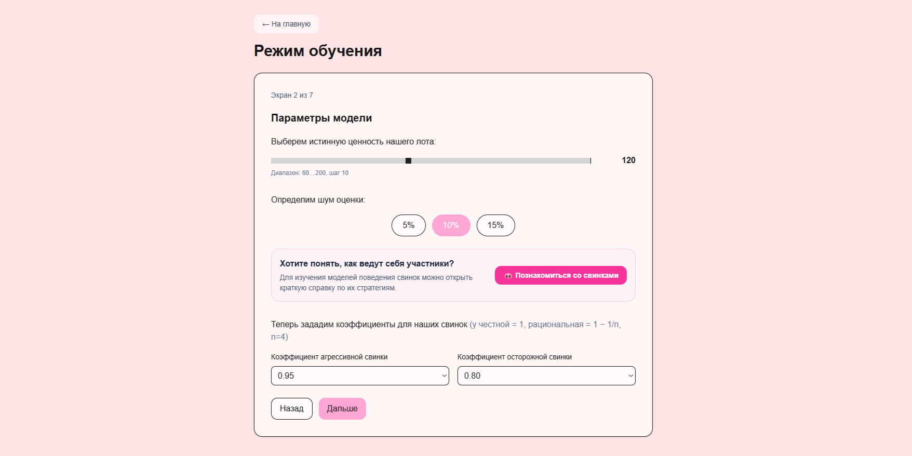

После запуска приложение генерирует оценки свинок-аукционеров и показывает результат: ставки, победителя, цену, субъективный выигрыш, ex post выигрыш и эффективность. В «Эксперименте» пользователь дополнительно видит статистику по множеству прогонов.

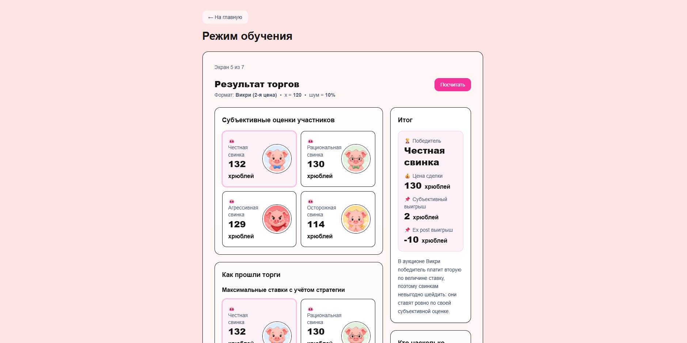

В режимах **«Демонстрация»** и **«Сравнение форматов»** доступна вкладка **«Справка»**. В ней описана вся необходимая теория: типы аукционов, поведение свинок-аукционеров и подсказки по стратегиям.

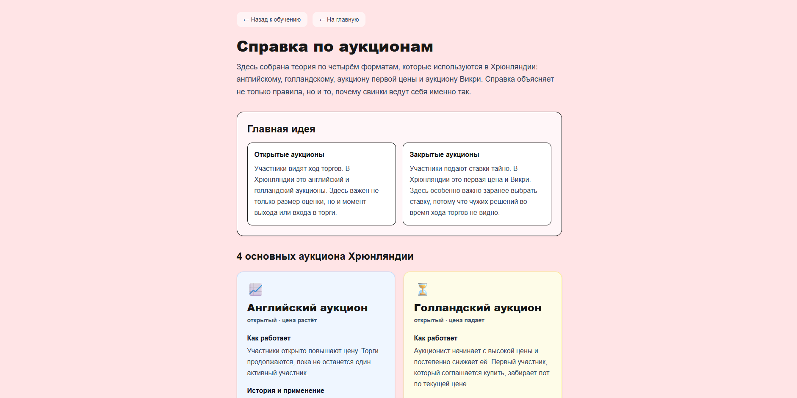

---

# Режим «Игра» 🎮

После изучения теории пользователь может перейти в полноценную игру против ботов. Здесь уже нет готового ответа: нужно самому принимать решения, следить за банком и выбирать, за какие лоты действительно стоит бороться.

## Экран 1 — выбор типа аукциона

Пользователь выбирает один из четырёх форматов:

- английский;
- голландский;
- первая цена;
- Викри.

Каждый формат имеет свою механику. Самым динамичным является английский аукцион: цена растёт, участники по очереди повышают ставку или пасуют.

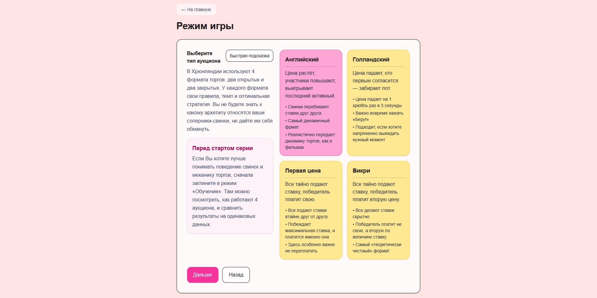

## Экран 2 — настройка серии

Здесь задаются:

- количество лотов;
- число соперников;
- уровень шума оценки;
- использование жетонов.

Банк зависит от количества лотов: 3 лота — 300 хрюблей, 5 — 500, 7 — 700, 9 — 900. Денег не хватает на бездумную покупку всего подряд, поэтому игроку приходится выбирать, где стоит рисковать, а где лучше сохранить монеты.

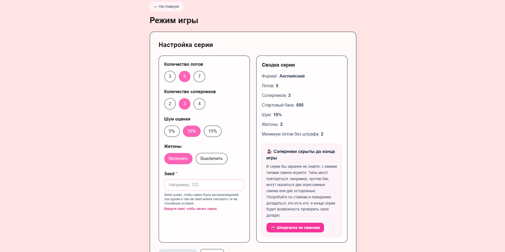

## Экран 3 — использование жетонов

Перед лотами пользователь выбирает, стоит ли использовать жетоны точности.

Жетон уменьшает шум оценки вдвое: вместо диапазона ±y игрок получает более точную оценку в диапазоне ±y/2. Это помогает лучше понять ценность лота, но жетонов мало, поэтому тратить их нужно с умом.

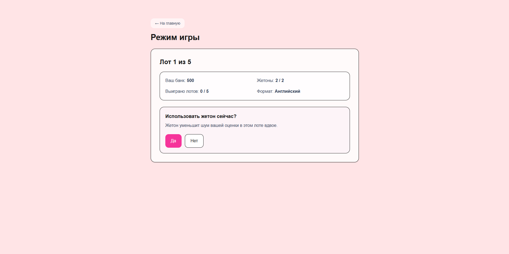

---

## Как проходят аукционы

### Английский аукцион

Цена постепенно растёт. На экране видно текущую цену, активных участников, историю повышений, собственную оценку игрока и остаток банка.

Игрок может повысить цену на **+1 / +2 / +3** или спасовать. Боты действуют по своим стратегиям: агрессивные могут делать резкие повышения, осторожные выходят раньше, рациональные и честные держатся до своей оценки.

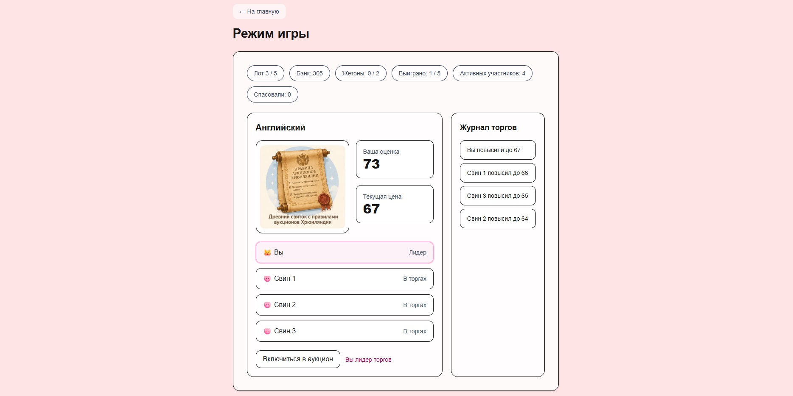

### Голландский аукцион

Цена постепенно падает. Задача игрока — вовремя нажать **«Беру!»** раньше остальных.

Главное — не купить слишком дорого, но и не ждать так долго, чтобы лот забрал соперник.

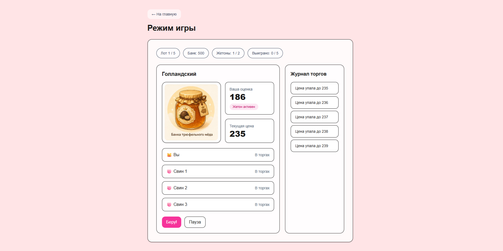

### Первая цена

Игрок делает закрытую ставку. Если ставка слишком низкая, лот уйдёт другому. Если слишком высокая, можно выиграть, но потерять прибыль.

Этот режим особенно хорошо показывает проблему шейдинга — занижения ставки относительно своей оценки.

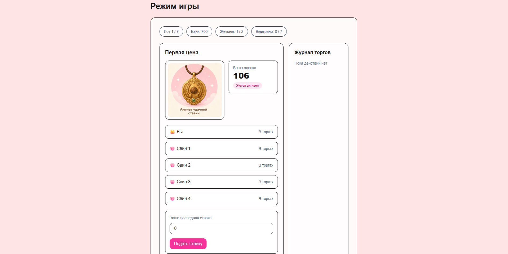

### Викри

Игрок делает закрытую ставку, но победитель платит вторую по величине цену.

Из-за этого появляется интересный эффект: ставить честно оказывается выгодно. Этот режим помогает понять одну из самых известных идей теории аукционов.

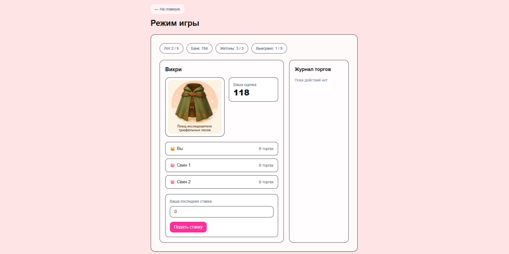

---

## Итоги серии 🏁

После завершения игры показывается полная статистика:

- победы;
- потраченные деньги;
- субъективный выигрыш;
- ex post выигрыш;
- ROI;
- остаток банка;
- результаты по каждому лоту.

Также у пользователя есть возможность угадать, какие именно свинки играли против него. Это помогает проверить, удалось ли распознать стратегии соперников по их поведению во время торгов.

Также в режиме «Игра» действует штраф за пассивность. Минимум побед без штрафа равен `ceil(количество лотов / 4)`. Если игрок выиграл меньше лотов, из итогового банка вычитается **100 хрюблей**. Это нужно, чтобы нельзя было просто всё время пасовать: игрок должен искать баланс между осторожностью и участием в торгах.

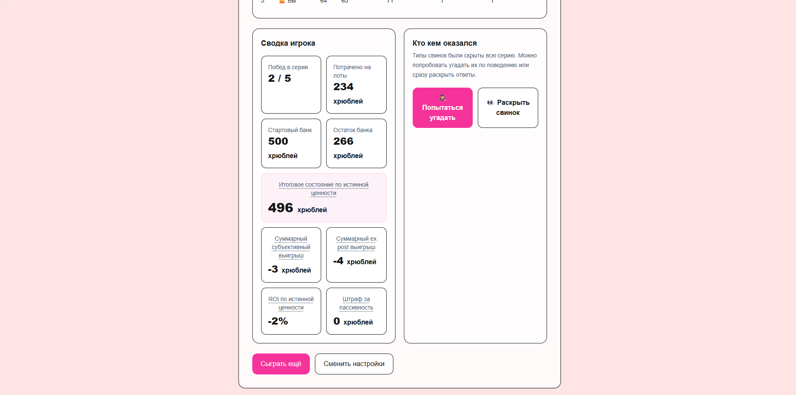

---

# Свиньи-аукционеры 🐷

## Честная свинка

В закрытых аукционах ставит по своей субъективной оценке. В английском аукционе повышает цену на +1, пока новая цена не превышает её оценку. В голландском берёт лот, когда цена опускается до её оценки.

## Агрессивная свинка

В первой цене и голландском аукционе использует ставку/порог `round(0.95 · оценка)`, то есть ставит близко к своей оценке. В английском аукционе обычно повышает на +1, но иногда делает jump-bid на +2 или +3, если это не выше её оценки. В Викри ставит честно, то есть всю свою оценку.

## Рациональная свинка

В первой цене и голландском аукционе снижает ставку по формуле `round((1 - 1/n) · оценка)`, где `n` — количество участников. В английском аукционе ведёт себя честно и повышает до своей оценки. В Викри тоже ставит всю оценку, потому что в этом формате честная ставка является лучшей стратегией.

## Осторожная свинка

В первой цене и голландском аукционе использует ставку/порог `round(0.80 · оценка)`, то есть заметно занижает ставку. В английском аукционе выходит раньше: держит небольшой запас и не повышает цену вплотную до своей оценки. В Викри ставит честно, то есть всю оценку.

---

# Параметры приложения ⚙️

**Истинная ценность лота `x`** — настоящая ценность лота в модели. Обычно находится в диапазоне от 60 до 200.

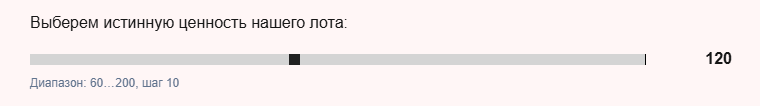

**Шум оценки `y`** — насколько неточно участники видят ценность лота. Чем выше шум, тем сложнее понять, сколько лот действительно стоит.

**Количество лотов** — длина серии. Для английского и голландского аукционов доступны 3, 5 или 7 лотов; для первой цены и Викри — 5, 7 или 9.

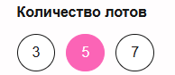

**Количество соперников** — число свинок-ботов в игре. Их типы скрыты и фиксируются на всю серию.

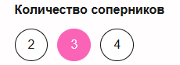

**Жетоны точности** — уменьшают шум оценки игрока на выбранном лоте. В открытых аукционах при 3 лотах даётся 1 жетон, при 5 или 7 — 2. В закрытых аукционах при 5 или 7 лотах даётся 2 жетона, при 9 — 3.

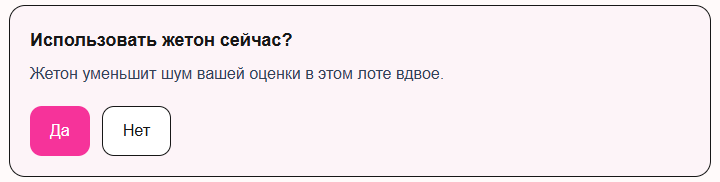

**Seed / Freeze** — настройка в режиме «Игра», которая фиксирует случайность и позволяет повторить серию с теми же исходными условиями.

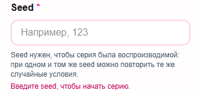

---

# Показатели и статистика 📊

**Субъективный выигрыш** = оценка победителя − цена. Показывает, насколько покупка выгодна с точки зрения самого победителя.

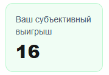

**Ex post выигрыш** = истинная ценность лота − цена. Показывает, была ли покупка выгодной относительно настоящей ценности.

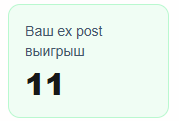

**Итоговое состояние по истинной ценности** — итоговый результат пользователя с учётом настоящей ценности купленных лотов. Этот показатель помогает понять, насколько покупки были выгодны не только по субъективной оценке, а относительно реальной ценности лотов.

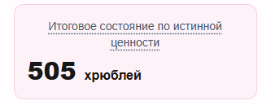

**Суммарный субъективный выигрыш** — общий выигрыш пользователя с точки зрения его собственных оценок лотов.

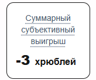

**Суммарный ex post выигрыш** — общий выигрыш пользователя относительно истинной ценности лотов.

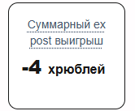

**ROI по истинной ценности** показывает итоговую эффективность игры для пользователя: насколько удачно он распорядился своими хрюблями.

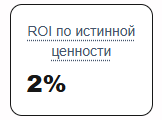

**Штраф за пассивность** — штраф, который применяется, если пользователь выиграл слишком мало лотов. Минимум побед без штрафа равен `ceil(количество лотов / 4)`. Если игрок выиграл меньше, из итогового результата вычитается 100 хрюблей.

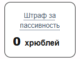

---

# Где можно пользоваться приложением 🌐

Хрюнляндия работает прямо в браузере. Пользоваться приложением можно на компьютере, ноутбуке, планшете или мобильном телефоне.

Ничего устанавливать не нужно. Достаточно открыть ссылку на сайт.

Возрастной рейтинг: **0+**.

---

# Похожие проекты

- **Veconlab — Online Experiments for Economics**: классические аукционы и рыночные игры  
  https://veconlab.econ.virginia.edu/

- **MobLab**: облачная платформа с экономическими играми и аукционами  
  https://moblab.com/

- **EconPort**: библиотека и ПО для учебных аукционов и экспериментов  
  http://www.econport.org/
